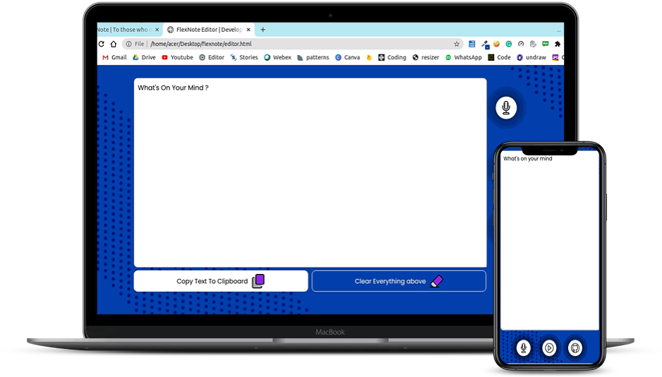

## SprintNote

SprintNote is a simple notepad developed to write notes effortlessly and with many features such as Voice Recognition, Text Speech Convertor, Copy Text etc

> Star this Project if you it Found Great

## Demo
<a href="https://sprintnote.vercel.app/">  Click Here For the demo</a>

## Features

  - Voice Recognition 
  - Hear what is wrote by Us 
  - Customise Everything 
  - Fully Responsive
  - Good UI
  - Copy Text in the Browser
  - New Thinks are coming ,Stick to Here

## Imprortant links
- Link To My Portfolio: http://savio.works/
- Go to the demo: https://sprintnote.vercel.app/
- Github Profile: https://github.com/saviomartin/
- Follow Me on Instgagram: https://www.instagram.com/teen_developer/

## License
<a href="https://github.com/saviomartin/sprintnote/blob/master/LICENSE.txt">MIT License</a>

### Developed By <a href="https://www.instagram.com/teen_developer/">Savio Martin</a>
